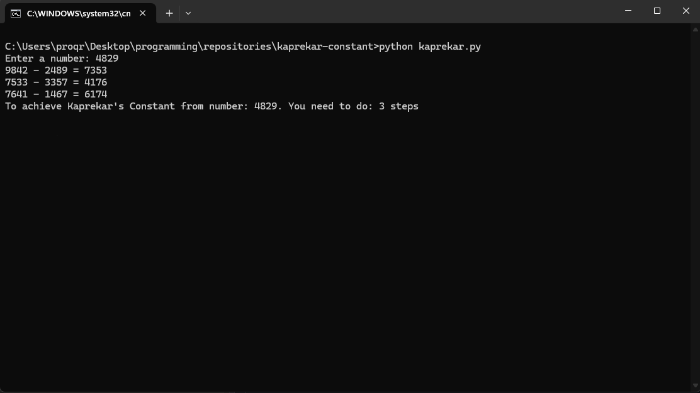

# Kaprekar's Constant

Python program that finds Kaprekar's Constant (6174) 
from any valid 4-digit number.

## How to run
python kaprekar.py

## How it works
Takes a 4-digit number, sorts digits ascending and descending,
subtracts smaller from bigger. Repeats until reaching 6174.

## Example

